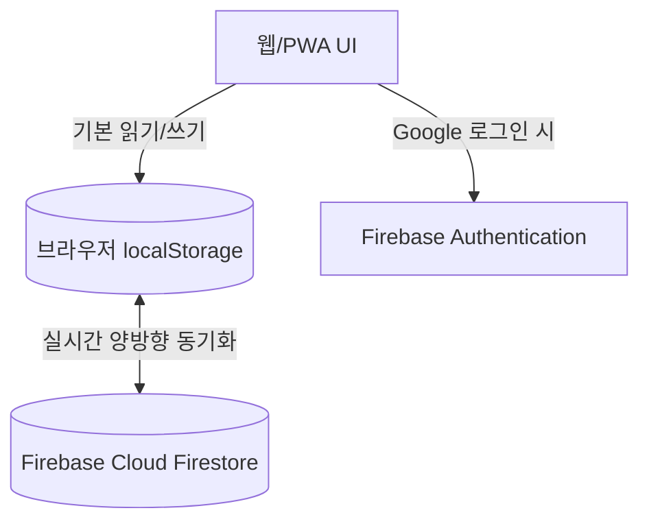

> [!info] 📌 프로젝트 요약
> **🌐 데모 링크:** [https://d-plus-day.web.app](https://d-plus-day.web.app)  
> **💻 깃허브 저장소:** [JaeHyeon-Jo/trace](https://github.com/JaeHyeon-Jo/trace)  
> **🛠️ 사용 기술:** Vanilla JavaScript, PWA (Progressive Web App), Firebase Authentication, Cloud Firestore, Chart.js  

---

## 💡 1. 기획 배경

이 프로젝트의 시작은 아주 단순하고 지극히 현실적인 의문에서 출발했습니다.  
**"아, 머리가 좀 지저분하네... 근데 나 마지막으로 이발한 게 2주 전인가, 4주 전인가?"**

남자들의 이발 주기는 보통 3~4주 정도지만, 바쁜 일상을 살다 보면 거울을 볼 때마다 머리 자른 날짜가 까마득히 헷갈리기 일쑤입니다. 흔히 쓰는 D-Day 앱들은 "시험 D-100", "휴가 D-10"처럼 **미래의 특정 날짜**만 세어줍니다. 

하지만 실제 일상과 육아, 업무를 돌아보면 우리에게 훨씬 필요한 기능은 따로 있습니다:
- **`이발`** *(3주 주기 — "며칠 남았지?")*
- **`유진이 손발톱`** *(2주 주기 — "어? 벌써 주기 지났네!")*
- **`칫솔 교체`** *(3개월 주기)*
- **`본가 / 시골 방문`** *(D+52일, D+86일)*
- **`아산물류센터 방문`** *(업무 — D+4일)*

우리는 미래의 일정보다 **마지막으로 행동한 이후 경과한 시간(D+)**을 훨씬 쉽게 잊어버립니다. 이 일상의 사소하지만 반복되는 불편함을 해결하기 위해, 지나간 시간을 기록하고 다음 주기까지 얼마나 남았는지 직관적으로 보여주는 **D+Day 트래커**를 직접 설계하고 개발했습니다.

---

## 📱 2. 사용자 경험 (UX)

제가 매일 실생활에서 실제로 사용 중인 D+Day 트래커 대시보드입니다.
![[Pasted image 20260727171026.png]]

### ① 직관적인 경고 바
- **`이발 (주기: 3주)`**: 2026-07-18에 깎아서 현재 `D+1주 2일` 경과, 다음 주기까지 **`12일 남음`** (안정적인 초록색 바 🟩)
- **`유진이 손발톱 (주기: 2주)`**: 2주가 딱 지나서 **`0일 지남`** 경고 (즉시 깎아주도록 눈에 띄는 빨간색 바 🟥)
- **`본가/시골 방문`**: 주기를 정하지 않고 단순 경과 일수(`D+52`, `D+86`)를 묵묵히 기록하여 자주 연락드릴 수 있는 리마인더 역할

### ② 실행 주기 히스토리
- 각 항목별로 지난 몇 달간 얼마의 간격으로 실행했는지 히스토리 그래프로 시각화하여, 주기가 일정하게 유지되고 있는지 패턴을 볼 수 있습니다.

### ③ PWA 홈 화면 설치
- 아이폰과 안드로이드 홈 화면에 앱처럼 바로 설치하여, 오프라인이나 지하철에서도 1초 만에 실행하고 기록할 수 있도록 설계했습니다.

---

## 🛠️ 3. 기술 아키텍처

`D+Day`는 **"로그인 없이도 즉시 작동해야 하고, 로그인하면 기기 간 원활하게 동기화되어야 한다"**는 원칙으로 아키텍처를 설계했습니다.

- **기본 저장소 (`localStorage`)**: 외부 서버 통신 없이 0초 만에 앱이 실행되며 완벽한 오프라인 읽기/쓰기를 보장합니다.
- **클라우드 백업 (`Firestore`)**: 사용자가 Google 로그인을 켜면 로컬 데이터와 Firestore DB가 자동으로 양방향 동기화되어 다중 기기(맥북 ↔ 아이폰) 환경을 완벽히 지원합니다.

---

## 💥 4. 트러블슈팅

이 프로젝트를 개발하며 겪은 가장 까다로우면서도 기술적으로 짜릿했던 경험은 **iOS Safari 브라우저의 ITP(Intelligent Tracking Prevention) 쿠키 차단 문제**였습니다.

> [!warning] 🚨 이슈 발생: 아이폰 Safari에서 구글 로그인이 무한 실패하는 현상
> 처음에 GitHub Pages(`https://jaehyeon-jo.github.io`)로 배포한 뒤 아이폰 Safari에서 구글 로그인을 시도하자, Firebase Auth의 `signInWithPopup` / `signInWithRedirect`가 권한 오류를 뿜으며 실패했습니다.

### Safari ITP 차단 원인
- Safari는 사용자의 프라이버시를 보호하기 위해 제3자(Third-party) 쿠키와 크로스 도메인 인증 세션을 강력하게 차단하는 **ITP 정책**을 작동시킵니다.
- `jaehyeon-jo.github.io`(GitHub Pages)와 Firebase Auth의 인증 도메인(`*.firebaseapp.com`)이 서로 다른 제3자 도메인으로 인식되면서 브라우저가 인증 세션 쿠키를 강제로 날려버린 것이 원인이었습니다.

### Firebase Hosting 전환 해결
- 이를 해결하기 위해 GitHub Pages 배포를 과감하게 포기하고 **Firebase Hosting**(`d-plus-day.web.app`)으로 전환했습니다.
- Firebase Hosting을 사용하면 호스팅 도메인(`*.web.app`)과 인증 서비스 도메인(`*.firebaseapp.com`)이 동일한 구글 Firebase 인프라 컨텍스트 안에서 처리됩니다.
- 그 결과, **Safari의 ITP 차단 정책을 완벽하게 우회**하고 iOS PWA 환경에서도 100% 안정적인 구글 로그인과 데이터 동기화 파이프라인을 구축할 수 있었습니다.

---

## ⚖️ 5. 데이터 정합성 (Tombstone)

기기 간 동기화를 구현할 때 가장 신경 쓴 부분은 **"데이터 삭제와 동시 수정 시의 데이터 정합성"**입니다.

1. **Last-Write-Wins (최신 수정 우선)**  
   동일 항목이 서로 다른 기기에서 수정되면 `updatedAt` 타임스탬프를 비교하여 가장 최근에 수정된 데이터를 최종 적용합니다.
2. **묘비(Tombstone) 삭제 패턴 (`deletedAt`)**  
   데이터를 삭제할 때 DB에서 레코드를 즉시 지워버리면, 아직 동기화되지 않은 다른 기기가 이 항목을 '새 데이터'로 오인해 DB로 다시 살려내는(좀비 데이터) 현상이 발생합니다.  
   이를 방지하기 위해 물리적 삭제 대신 `deletedAt` 타임스탬프를 남겨 삭제 상태를 전체 기기에 전파한 뒤 화면에서 숨기도록 구현했습니다.

---

## 🎉 6. 회고 및 마치는 글

`D+Day`는 남들이 만들어 둔 거창한 서비스 클론이 아니라, **"나 머리 언제 잘랐지?", "유진이 손발톱 며칠 됐지?" 같은 내 일상의 실제 불편함에서 출발해 프론트엔드 UX, 모바일 브라우저 보안 정책, 분산 데이터 동기화 문제까지 직접 맞부딪히며 해결한 실전 프로젝트**입니다.

앞으로도 생활 속의 작은 문제를 그냥 지나치지 않고, 유쾌하고 단단한 엔지니어링으로 풀어내는 도전을 계속해 나가려 합니다.

---

## 🔗 함께 읽으면 좋은 글
- [[Obsidian-GPS-위치-삽입-플러그인-개발기|Obsidian GPS Location — 내 입맛대로 만드는 메모 앱 플러그인]]
- [[lite-capture-개발기|lite-capture — 내 입맛대로 만든 10MB 캡처 도구 개발 회고]]
- [[index|🍱 Guri Blog 홈으로 돌아가기]]

