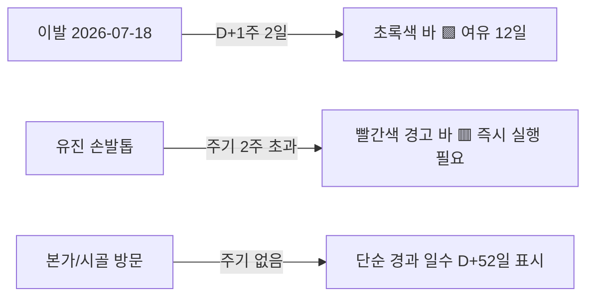
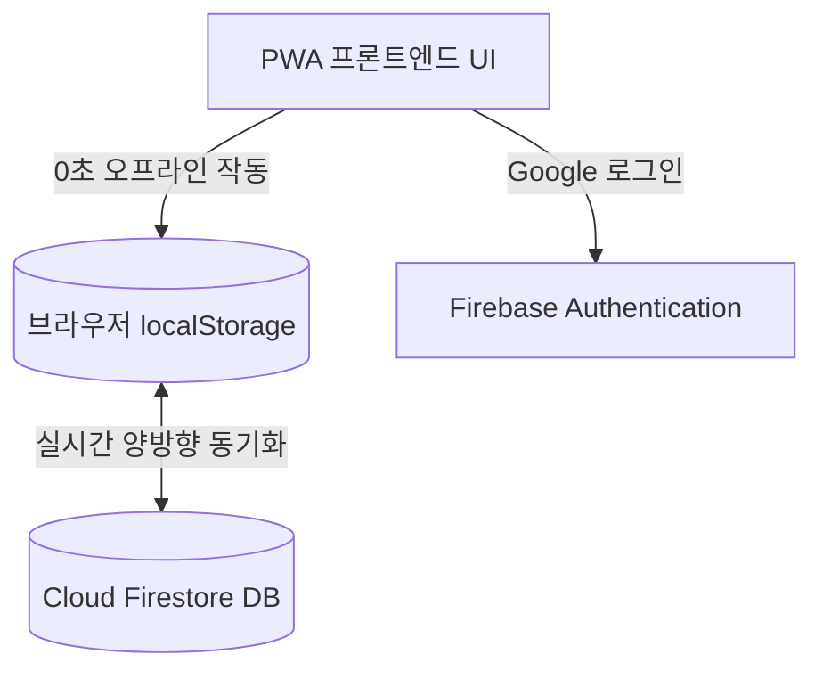

  
<strong>📌 프로젝트 요약</strong>

  <ul>
    <li><strong>🌐 데모 웹사이트:</strong> <a href="https://d-plus-day.web.app">d-plus-day.web.app</a></li>
    <li><strong>💻 깃허브 저장소:</strong> <a href="https://github.com/JaeHyeon-Jo/trace">JaeHyeon-Jo/trace</a></li>
    <li><strong>🛠️ 사용 기술:</strong> Vanilla JavaScript, PWA, Firebase Auth & Firestore, Chart.js</li>
    <li><strong>✨ 핵심 기능:</strong> 과거 실행일부터 경과 일수(D+) 및 다음 주기 경고 바 시각화, 모바일 PWA</li>
  </ul>

---

## 💡 1. 기획 배경

> *"아, 머리가 좀 지저분하네… 근데 나 마지막으로 이발한 게 2주 전인가, 4주 전인가?"*

일반적인 D-Day 앱들은 "시험 D-100"처럼 미래의 특정 날짜를 세어줍니다.  
하지만 일상에서 진짜 헷갈리는 것은 **"마지막 행동 이후 얼마나 지났는가(D+)"**입니다.

- **이발** (주기: 3주 — *며칠 남았지?*)
- **유진이 손발톱** (주기: 2주 — *벌써 지났네!*)
- **칫솔 교체** (주기: 3개월)

과거의 실행일을 기록하고 다음 주기까지 남은 기간을 시각적으로 보여주는 **D+Day 트래커**를 개발했습니다.

---

## 📱 2. 사용자 경험 (UX) & 시각화

### ① 컬러 경고 바 (Alert Bar)
- **초록색 바 (🟩):** 설정 주기에 여유가 있을 때 (예: 이발 D+10일, 11일 남음)
- **빨간색 경고 바 (🟥):** 주기가 초과되어 즉시 실행해야 할 때 (예: 손발톱 2주 0일 경과)

### ② Chart.js 실행 주기 히스토리
- 각 항목별로 지난 몇 달간 얼마의 간격으로 실행했는지 **그래프 시각화**하여 일정한 습관 패턴을 확인합니다.

### ③ 아이폰/안드로이드 PWA 설치
- 홈 화면에 앱 아이콘으로 설치하여 지하철이나 오프라인에서도 **1초 만에 앱 열기 및 즉시 기록**을 지원합니다.

---

## 🛠️ 3. 기술 아키텍처 (PWA + Firebase)

| 기능 | 로컬 (localStorage) | 클라우드 (Firestore) |
| :--- | :--- | :--- |
| **작동 방식** | 로그인 없이 0초 만에 완벽한 읽기/쓰기 | Google 로그인 시 로컬 데이터 자동 병합 |
| **기기 호환** | 오프라인 기기 단독 보관 | 맥북 ↔ 아이폰 ↔ 안드로이드 간 실시간 동기화 |

---

## 💥 4. 핵심 트러블슈팅

> [!warning] **iOS Safari ITP 쿠키 차단 문제 해결**
> - **문제:** GitHub Pages 도메인에서 로그인 시 Safari의 ITP 정책이 제3자 인증 쿠키를 강제 삭제
> - **해결:** 호스팅을 **Firebase Hosting(`*.web.app`)**으로 전환하여 인증과 호스팅 도메인을 동일 구글 인프라로 통일, 100% 안정적인 로그인 달성

> [!tip] **분산 기기 데이터 정합성 (Tombstone 패턴)**
> - 데이터 물리적 삭제 대신 **`deletedAt` 타임스탬프(묘비)**를 남겨 다른 기기가 삭제된 항목을 '새 데이터'로 오인해 DB로 되살려내는 현상 차단

---

## 🎉 5. 마치며

`D+Day`는 거창한 클론 코딩이 아니라, 내 실제 생활 속 사소한 불편함에서 출발해 프론트엔드 UX, 브라우저 보안 정책, 데이터 동기화까지 직접 해결해 본 즐거운 실전 프로젝트입니다.

---

## 🔗 함께 읽으면 좋은 글
- [[Obsidian-GPS-위치-삽입-플러그인-개발기|Obsidian GPS Location — 내 입맛대로 만드는 메모 앱 플러그인]]
- [[lite-capture-개발기|lite-capture — 내 입맛대로 만든 10MB 캡처 도구 개발 회고]]
- [[index|🍱 Guri Blog 홈으로 돌아가기]]
