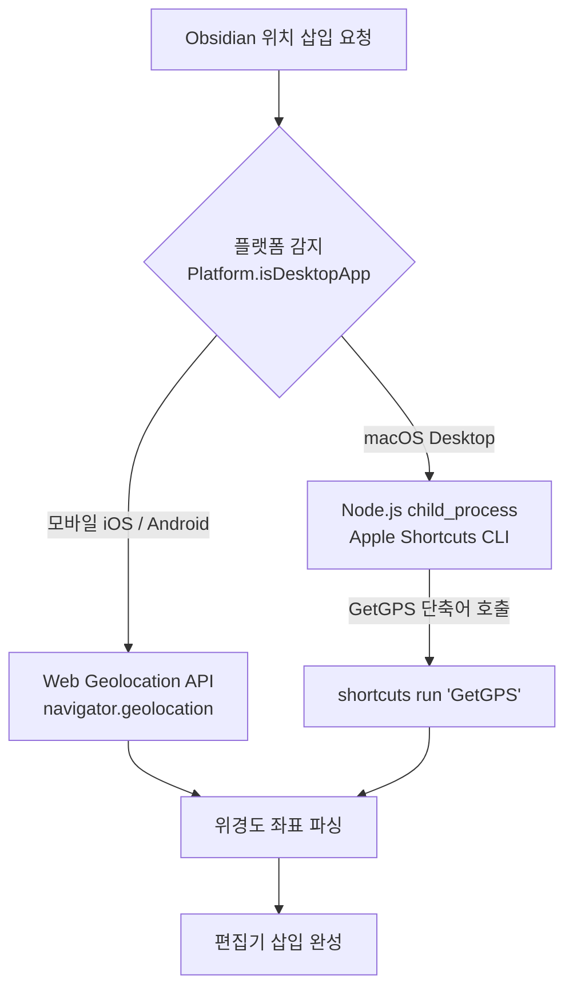

<div class="popover-hint">
  <p><strong>📌 프로젝트 요약</strong></p>
  <ul>
    <li><strong>💻 깃허브 저장소:</strong> <a href="https://github.com/JaeHyeon-Jo/Obsi_InsertLoc">JaeHyeon-Jo/Obsi_InsertLoc</a></li>
    <li><strong>🛠️ 사용 기술:</strong> TypeScript, Obsidian Plugin API, macOS Apple Shortcuts (CLI), Node.js child_process</li>
    <li><strong>✨ 핵심 기능:</strong> 리본 버튼/명령어 원클릭으로 현재 시간·GPS 좌표 삽입 (Map View 지도 플러그인 호환)</li>
  </ul>
</div>

---

## 💡 1. 들어가며

> *"아주 간단한 기능이라도, 내 기록 습관과 워크플로우에 딱 맞는 나만의 메모 앱을 만들 수 없을까?"*

독립적인 앱을 개발하는 것과는 또 다르게, **옵시디언(Obsidian)의 개방적인 플러그인 생태계는 제2의 뇌(Second Brain)를 직접 확장하고 다듬는 무한한 자유도**를 보여주었습니다.

임장 기록, 식당 방문 기록, 야외 아이디어 메모 작성 시 **"내가 지금 어디에 있는지"** 지도 좌표를 매번 복사·붙여넣기하던 번거로움을 1초 만에 해결한 **`Obsi_InsertLoc`** 플러그인 개발 회고입니다.

---

## 📱 2. 사용자 경험 (UX) & 마크다운 시각화


```markdown
14:20 [현재 위치](geo:37.4912,126.9244) #위치
```

### ① 커서 위치 1초 삽입
- 클릭 한 번으로 현재 시간(HH:mm)과 GPS 위경도 좌표 링크를 마크다운으로 자동 삽입합니다.

### ② Map View 플러그인 완벽 호환
- 유명 지도 플러그인 **[Obsidian Map View]**의 표준 문법(`geo:lat,lon #태그`)을 준수하여, 삽입 즉시 전체 지도 화면에 핀으로 연결됩니다.

### ③ 시계 + 지도 핀 커스텀 SVG (`clock-map-pin`)
- 시계와 마커 핀을 형상화한 전용 SVG 아이콘을 제작하여 데스크톱 및 모바일 툴바 UI에 완벽히 어우러집니다.

---

## 🛠️ 3. 기술 구조 (macOS 단축어 ↔ 모바일 하이브리드)



| 실행 플랫폼 | 측위 엔진 | 핵심 해결 과제 |
| :--- | :--- | :--- |
| **모바일 (iOS/Android)** | `navigator.geolocation.getCurrentPosition` | 스마트폰 네이티브 고정밀 GPS 센서 즉시 조회 |
| **데스크톱 (macOS)** | `shortcuts run "GetGPS"` (Apple Shortcuts) | Electron 앱의 위치 권한 한계를 OS 단축어 CLI로 돌파 |

---

## 💥 4. 핵심 트러블슈팅

> [!warning] **모바일 앱 빌드 시 Node.js 내장 모듈 충돌 방어**
> - **문제:** 상단에서 `import { exec } from 'child_process'` 선언 시, 모바일 앱에서 Node.js 내장 모듈 미지원으로 플러그인 크래시
> - **해결:** `Platform.isDesktopApp` 분기 내부에서만 **동적 로딩(`require('child_process')`)**을 호출하도록 분리하여 하나의 번들로 크로스 플랫폼 호환 달성

---

## 🎉 5. 마치며

기성 앱의 스펙에 나를 맞추지 않고, **필요한 기능이 없다면 단 몇 시간 만에 직접 구현해 내 메모장에 심어버릴 수 있다는 무한한 확장성**을 체감한 의미 있는 프로젝트였습니다.

---

## 🔗 함께 읽으면 좋은 글
- [[lite-capture-개발기|lite-capture — 내 입맛대로 만든 10MB 캡처 도구 개발 회고]]
- [[D-Plus-Day-기록-트래커-개발기|D+Day — 이발 주기 헷갈려서 만든 D+ 트래커 개발 회고]]
- [[index|🍱 Guri Blog 홈으로 돌아가기]]
