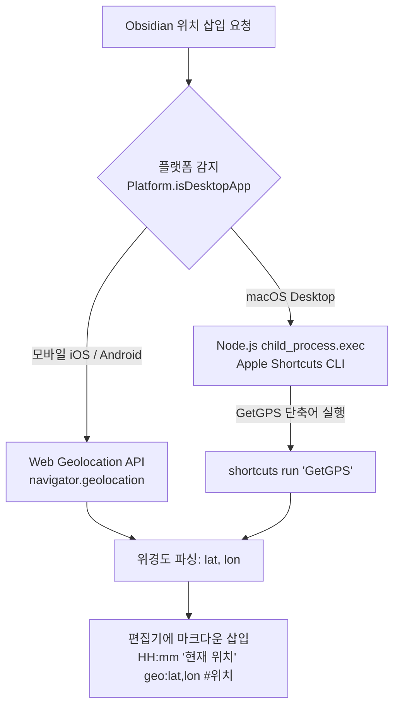

<div class="popover-hint">
  <p><strong>📌 프로젝트 요약</strong></p>
  <ul>
    <li><strong>💻 깃허브 저장소:</strong> <a href="https://github.com/JaeHyeon-Jo">JaeHyeon-Jo/Obsi_InsertLoc</a></li>
    <li><strong>🛠️ 사용 기술:</strong> TypeScript, Obsidian Plugin API, macOS Apple Shortcuts (CLI), Node.js child_process, Web Geolocation API</li>
    <li><strong>✨ 핵심 기능:</strong> 단축키/리본 버튼 원클릭으로 현재 시간 및 GPS 좌표 마크다운 삽입 (Map View 플러그인 호환)</li>
  </ul>
</div>

---

## 💡 1. 들어가며: 왜 옵시디언 플러그인을 직접 만들었을까?

평소 여러 편의 기능을 담은 독립적인 로컬 앱(`lite-capture`, `D+Day` 등)을 직접 개발해 오고 있었지만, 이번 프로젝트는 조금 특별했다. **"옵시디언(Obsidian)의 개방적인 플러그인 생태계가 얼마나 무궁무진한 개발 자유도를 제공하는지"** 깨닫게 해준 경험이었기 때문이다.

일상을 기록하고 메모를 다듬다 보면, 특정 순간에 **"내가 지금 어디에서 이 글을 쓰고 있는지"** 위치 정보를 남기고 싶을 때가 많다. 식당 방문 기록을 적거나, 임장 기록을 남기거나, 야외에서 떠오른 아이디어를 노트에 담을 때 현재 위치 좌표를 수동으로 지도에서 검색해 복사·붙여넣기하는 과정은 생각보다 번거롭다.

*"아주 간단한 기능이라도, 내 기록 습관과 워크플로우에 딱 맞는 나만의 플러그인을 만들 수 없을까?"*

이 단순한 호기심으로 시작된 **Obsidian GPS Location Plugin(`Obsi_InsertLoc`)** 개발은, 기존 메모 앱의 한계에 갇히지 않고 **내 입맛에 맞게 완벽히 다듬어진 제2의 뇌(Second Brain)**를 만드는 짜릿한 인상을 남겼다.

---

## 📱 2. 주요 기능 및 사용자 경험 (UX)

이 플러그인은 철저히 **'0초 개입, 원클릭 완성'**을 목표로 설계되었다.

```
14:20 [현재 위치](geo:37.4912,126.9244) #위치
```

### ① 커서 위치에 1초 만에 시간 & 좌표 삽입
- 좌측 리본 바의 아이콘을 클릭하거나 명령어(Command Palette: `Insert Current Geolocation`)를 실행하면, 현재 시간과 정확한 GPS 위경도 좌표가 마크다운 텍스트로 즉시 삽입된다.

### ② Map View 플러그인 완벽 호환
- 단순한 텍스트 나열에 그치지 않고, 옵시디언의 유명 지도 시각화 플러그인인 **[Obsidian Map View]**가 기본 인식하는 `[표시명](geo:위도,경도) #태그` 표준 URI 문법을 준수했다.
- 덕분에 위치를 삽입하는 즉시 노트 전체 지도 화면에서 내 노트들이 핀으로 반짝이며 연결된다.

### ③ 직관적인 커스텀 아이콘 (`clock-map-pin`)
- 시계(시간)와 마커 핀(위치)을 형상화한 커스텀 SVG 아이콘을 직접 제작하여 플러그인 아이콘으로 등록했다.
- 어떤 테마나 모바일 툴바에서도 이질감 없이 옵시디언 네이티브 UI처럼 어우러진다.

---

## 🛠️ 3. 기술 아키텍처: 데스크톱 ↔ 모바일 하이브리드 측위

이 플러그인의 기술적으로 가장 재미있는 지점은 **"macOS 데스크톱과 모바일(iOS/Android) 앱 간의 동작 환경 차이를 우아하게 극복한 하이브리드 아키텍처"**이다.



### 1) 모바일 환경 (iOS / Android)
- 모바일 옵시디언은 스마트폰 디바이스 자체의 GPS 센서에 쉽게 접근할 수 있다.
- 웹 표준 API인 `navigator.geolocation.getCurrentPosition()`을 호출하여 고정밀(High Accuracy) GPS 좌표를 비동기로 가져온다.

### 2) 데스크톱 환경 (macOS)
- 반면, 데스크톱 환경의 Electron 기반 앱에서는 네이티브 위치 권한 획득이 불명확하거나 오차가 발생하기 쉽다.
- 이를 해결하기 위해 macOS의 강력한 OS 자동화 도구인 **Apple Shortcuts(단축어)**와 Node.js의 `child_process`를 결합했다.

```typescript
// macOS 단축어를 활용한 네이티브 GPS 획득 로직
const cp = require('child_process');
const util = require('util');
const execAsync = util.promisify(cp.exec);

const { stdout } = await execAsync('shortcuts run "GetGPS"');
const output = stdout.trim();
const match = output.match(/(-?\d+(\.\d+)?)[,\s]+(-?\d+(\.\d+)?)/);
```

- macOS 단축어 앱에 현재 위경도를 텍스트로 출력하는 `GetGPS` 단축어를 만들어 두고, 플러그인에서 명령어 CLI(`shortcuts run`)로 호출해 OS 커널이 제공하는 100% 정확한 네이티브 좌표를 수신한다.

---

## 💥 4. 트러블슈팅

### 이슈 1. 모바일 앱 빌드 시 Node.js 내장 모듈 충돌
- **문제 현상:** macOS 단축어 실행을 위해 `import { exec } from 'child_process'`를 최상단에 선언하자, 모바일 앱 환경에서 로딩할 때 Node.js 내장 모듈을 찾지 못해 플러그인 자체가 크래시되는 현상.
- **해결 방안:** 모바일과 데스크톱 하나의 번들(main.js)로 실행되도록, `Platform.isDesktopApp` 분기 내부에서만 **동적 require(`require('child_process')`)**를 부르도록 지연 로딩하여 모바일 호환성을 완벽하게 지켜냈다.

### 이슈 2. GPS 응답 지연 및 타임아웃 방어
- **문제 현상:** 실내 환경이나 네트워크 상태에 따라 GPS 수신이 끝없이 지연되며 편집기 입력이 멈추는 이슈.
- **해결 방안:** 모바일 `getCurrentPosition`의 `timeout: 10000`, `maximumAge: 0` 옵션을 명시하여 최대 10초 이내에 수신되지 않으면 명확한 에러 노티피케이션(`Notice`)을 띄워 UX를 보호했다.

---

## 🎉 5. 마치며: 내 입맛대로 만드는 메모 앱의 매력

> *"아주 간단한 기능이지만, 정말 내 입맛에 맞게 메모 앱을 확장하고 다듬을 수 있다는 게 아주 인상 깊었다."*

`Obsi_InsertLoc` 플러그인은 기능적으로 보면 버튼을 눌러 글자 몇 줄을 넣어주는 작은 유틸리티일 수 있다. 하지만 개발자로서 이 프로젝트가 준 효능감은 그 어떤 거대 앱보다 컸다.

우리는 흔히 메모 앱이나 툴을 선택할 때 "이 앱에는 A 기능이 없어서 아쉽다"며 기성 제품의 스펙에 내 일하는 방식을 맞추곤 한다. 하지만 옵시디언의 플러그인 생태계를 직접 경험해 보니, **필요한 기능이 없다면 단 몇 시간 만에 내 손으로 직접 구현해 내 메모장 안에 심어버릴 수 있는 무한한 확장성**을 체감했다.

별도의 독립 앱을 개발하는 것과는 또 다른, **"내가 매일 살아 숨 쉬며 글을 쓰는 제2의 뇌 공간을 스스로 다듬고 조립해 나가는 즐거움"**을 많은 개발자들이 함께 느껴보길 추천한다.

---

## 🔗 함께 읽으면 좋은 글
- [[lite-capture-개발기|lite-capture — 내 입맛대로 만든 10MB 캡처 도구 개발 회고]]
- [[D-Plus-Day-기록-트래커-개발기|D+Day — 이발 주기 헷갈려서 만든 D+ 트래커 개발 회고]]
- [[index|🍱 Guri Blog 홈으로 돌아가기]]
