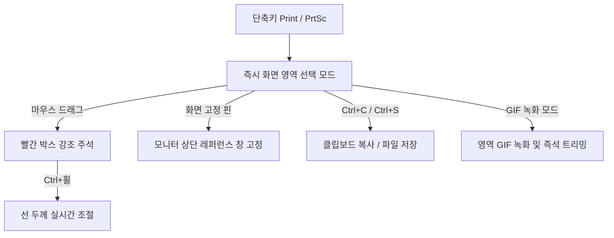

> [!info] 📌 프로젝트 요약
> **🌐 최신 버전 다운로드 (Releases):** [LiteCapture.exe (GitHub Releases)](https://github.com/JaeHyeon-Jo/lite-capture/releases)  
> **💻 깃허브 저장소:** [JaeHyeon-Jo/lite-capture](https://github.com/JaeHyeon-Jo/lite-capture)  
> **🛠️ 사용 기술:** Python 3, Qt, Win32 API (`RegisterHotKey`, GDI, Mutex), PyInstaller, GitHub Actions CI/CD  

---

## 💡 1. 들어가며

> *"AI로 어디까지 개발할 수 있을까?"*

처음에는 이 단순하고 가벼운 호기심에서 시도하다 보니 어느덧 여기까지 오게 되었다. 보통 사람들에게 잘 보이는 화려한 웹 서비스를 만드는 것도 참 재밌지만, **로컬 서버를 활용하거나 내 PC에서 매일 직접 돌아가는 프로그램을 내 손으로 직접 만드는 일**이 생각보다 훨씬 각별한 즐거움을 주었다.

특히 하루에도 수십 번씩 사용하는 '화면 캡처'는 기존에도 훌륭하고 기능이 넘치는 프로그램들이 참 많다. 하지만 쓰다 보면 굳이 필요 없는 팝업이 뜨거나, 무겁게 시스템 리소스를 차지하거나, 내 작업 흐름과는 미묘하게 어긋나는 불편함이 꼬리를 물었다.

**"더 이상 기존에 있는 기성 제품을 쓰는 것이 아닌, 내가 원하는 기능만 조합해서 쓸 수 있는 시대가 되었다."**  
이 확신을 바탕으로, 내 일상과 코딩 업무에 딱 필요한 기능만 담아낸 초경량 Windows 화면 캡처·GIF 녹화 도구 **`lite-capture`**를 직접 개발하게 되었다.

---

## 🎯 2. 핵심 철학

이 프로젝트의 핵심은 새로운 개별 기술의 발명이 아니라, **"이미 존재하는 익숙한 기능들을 내 작업 흐름(Workflow)에 가장 편리한 형태로 최적화하는 것"**에 있다.

시중에는 화려하고 많은 기능을 가진 캡처 도구들이 많다. 하지만 기능이 많을수록 프로그램은 무거워지고, 단 한 번의 영역 캡처를 위해 원하지 않는 편집기가 열리거나 무거운 백그라운드 리소스를 소모하곤 한다.

- **내 손에 딱 맞는 전역 단축키와 직관적인 UI 조작법**
- **복잡한 설정 없이 10MB 안팎의 단일 실행 파일(`.exe`) 하나로 어디서나 0초 실행**
- **캡처 → 빨간 박스 주석 → 고정(핀)이나 복사가 끊김 없이 한 번에 이어지는 쾌적함**

**"이미 남들이 만들어 둔 도구가 있더라도, 내 일하는 방식에 맞춰 직접 다듬고 개발할 때 압도적으로 높은 생산성을 얻을 수 있다"**는 것이 `lite-capture`를 개발하며 실천한 핵심 철학이다.

---

## 📱 3. 주요 기능 (UX)

`lite-capture`는 최소한의 조작으로 즉각적인 피드백을 주는 기능들로 압축되어 있다.



### ① 화면 고정 (핀 창)
![[lite-capture-pin.jpg]]

- 캡처한 영역을 **'화면 고정(핀)'**하면 모니터 최상단에 작은 오버레이 창으로 띄워둘 수 있다.
- 코딩을 할 때 API 문서나 참고 시안, 혹은 필요한 정보를 화면 구석에 핀으로 박아두고 작업하면 듀얼 모니터 없이도 화면 전환의 피로도가 극적으로 줄어든다.
- 기존 다른 캡처 도구들에도 고정 기능이 존재하지만, `lite-capture`는 **캡처 즉시 버튼 클릭이나 단축키로 불필요한 여백 없이 이미지 자체만 깔끔하게 띄우도록 최적화**했다.

### ② 전역 단축키 & 트레이 상주
- 프로그램을 실행해도 창이 뜨지 않고 **Windows 트레이 아이콘**에 조용히 상주한다.
- 어떤 프로그램을 쓰고 있든 기본 전역 단축키 `Print(PrtSc)` 키 하나면 즉시 화면 선택 모드로 진입한다.

### ③ 빨간 박스 & 선 두께 조절
- 선택 영역 위를 드래그하면 가장 자주 쓰는 직관적인 **빨간 강조 박스**가 즉시 그려진다.
- 메뉴 바에서 선 두께를 찾을 필요 없이, 마우스 포인터 위에서 `Ctrl + 마우스 휠`을 돌리면 **선의 두께가 실시간으로 조절**된다.

### ④ 클립보드 복사 & 저장
- `Ctrl+C`로 즉시 클립보드에 복사해 메신저나 옵시디언(Obsidian) 문서에 붙여넣을 수 있다.
- `Ctrl+S`를 누르면 원본 이미지 파일로 즉시 로컬 폴더에 저장된다.

### ⑤ GIF 녹화 & 트리밍
- 버그를 재현하거나 UI 인터랙션을 녹화할 때 필수적인 **GIF 녹화 기능**을 지원한다.
- 녹화 직후 앞뒤의 불필요한 멈춤 구간을 즉석에서 트리밍(잘라내기)해 바로 복사하거나 저장할 수 있어 PR이나 블로그 포스팅 속도를 높여준다.

---

## 🛠️ 4. 기술 아키텍처

Python의 높은 개발 생산성과 Windows OS 네이티브 속도를 모두 잡기 위해 **Qt(UI/렌더링)**와 **Win32 API(시스템 제어)**를 결합한 하이브리드 설계를 채택했다.

```
lite-capture/
├── main.py                # 진입점 및 트레이/단축키 제어
├── capture_window.py      # GDI 고속 캡처 및 오버레이 윈도우
├── draw_proposal.py       # 빨간 박스 주석 및 마우스 휠 이벤트 처리
├── pin_window.py          # Always-on-Top 화면 고정(핀) 창 UI
├── gif_recorder.py        # 프레임 캡처 및 GIF 인코딩
├── gif_editor.py          # GIF 앞뒤 구간 트리밍 UI
└── global_hotkey.py       # Win32 RegisterHotKey 네이티브 제어
```

- **Win32 `RegisterHotKey` 연동:** 일반적인 키보드 후킹 라이브러리 대신 Windows API의 `RegisterHotKey`를 직접 호출하여, 시스템 리소스를 낭비하지 않으면서 다른 프로그램과의 단축키 충돌을 방지했다.
- **GDI 고속 캡처:** 고해상도 모니터에서도 캡처 모드 진입 시 깜빡임이나 딜레이가 없도록 바탕화면 버퍼를 순간적으로 스냅샷 캡처한다.

---

## 💥 5. 트러블슈팅

### 이슈 1. SmartScreen 서명 경고
- **문제 현상:** PyInstaller로 빌드한 `LiteCapture.exe`를 새 PC에서 다운로드해 실행하면 Windows Defender SmartScreen이 "Windows의 PC 보호" 경고 창을 띄우며 실행을 멈추는 현상.
- **원인 분석:** 개인이 배포하는 단일 실행 파일(`.exe`)은 유료 EV/OV 코드 서명 인증서(Code Signing Certificate)가 서명되어 있지 않고, 초기 누적 다운로드 수(평판)가 낮아 Windows 커널 스마트스크린에 필터링된다.
- **해결 방안:** 사용자 경험을 위해 **README에 `[추가 정보] → [실행]` 안내 문구를 명확히 문서화**하여 첫 사용자의 당혹감을 해소했다.

### 이슈 2. 중복 실행 뮤텍스 방어
- **문제 현상:** 트레이에 숨어 있는 앱 특성상 사용자가 실행된 줄 모르고 `LiteCapture.exe`를 중복 실행하면, 전역 단축키 후크가 꼬이거나 리소스를 두 배로 점유하는 이슈.
- **해결 방안:** Win32 네이티브 **뮤텍스(Mutex, 단일 인스턴스 보장)** 메커니즘을 적용하여, 이미 프로세스가 동작 중일 경우 새 실행 요청은 부드럽게 무시되고 기존 트레이 인스턴스만 유지되도록 방어 로직을 구현했다.

---

## 📦 6. CI/CD 자동 배포

로컬에서 매번 `pyinstaller` 명령어로 빌드하고 바이너리를 깃허브에 올리는 반복 작업을 없애기 위해 **GitHub Actions CI/CD 파이프라인(`.github/workflows/release.yml`)**을 구축했다.

```yaml
# 릴리즈 자동화 핵심 흐름
on:
  push:
    tags:
      - 'v*'  # v1.0.0 등의 태그가 푸시될 때만 작동

jobs:
  build-and-release:
    runs-on: windows-latest
    steps:
      - name: Checkout Code
        uses: actions/checkout@v3
      - name: Build EXE with PyInstaller
        run: |
          pip install -r requirements-dev.txt
          pyinstaller main.spec --noconfirm
      - name: Upload to GitHub Release
        uses: softprops/action-gh-release@v1
        with:
          files: dist/LiteCapture.exe
```

- 릴리즈가 필요할 때 Git 태그(`git tag v1.0.0` → `git push origin --tags`)만 푸시하면, **Windows 클라우드 러너**가 의존성을 설치하고 `exe` 파일을 빌드해 **GitHub Release 페이지에 자동으로 첨부**해 준다.

---

## 💭 7. 마치며

> *"지금 비슷한 기능을 가진 프로그램을 여러 개 쓰고 있다면, 하나로 합쳐보는 건 어떨까?"*

`lite-capture` 프로젝트는 단순한 화면 캡처 유틸리티 그 이상의 의미가 있다. 

**"더 이상 기존에 있는 기성 제품에 내 업무를 맞추어 쓰는 것이 아니라, 내가 원하는 기능만 조합해서 나만의 맞춤형 프로그램으로 만들어 쓰는 시대가 되었다"**는 사실을 몸소 체감했기 때문이다.

웹 서비스를 만들어 사람들에게 선보이는 일도 멋지고 즐겁지만, 로컬 환경에서 내가 매일 피부로 체감하며 사용하는 프로그램을 직접 다듬고 개선해 나가는 과정은 개발자로서 잊을 수 없는 짜릿한 재미를 안겨주었다.

지금 컴퓨터에서 캡처, 녹화, 메모, 화면 고정 등을 위해 비슷비슷한 도구들을 여러 개 켜두고 있다면, **"내 입맛에 맞게 핵심 기능만 하나로 합쳐보면 어떨까?"**라는 질문을 던져보길 추천한다. 바로 그 호기심이 여러분의 업무 효율과 개발의 즐거움을 완벽하게 바꿔놓을 것이다.
