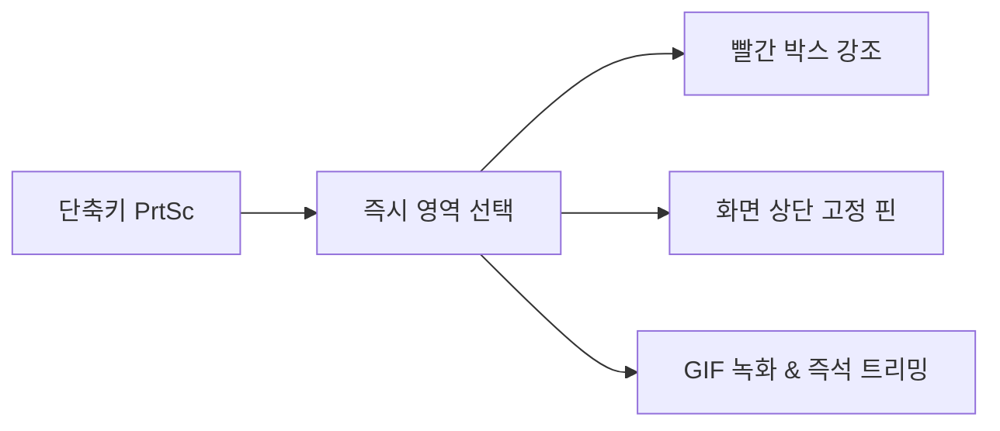
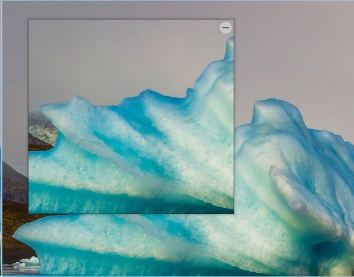
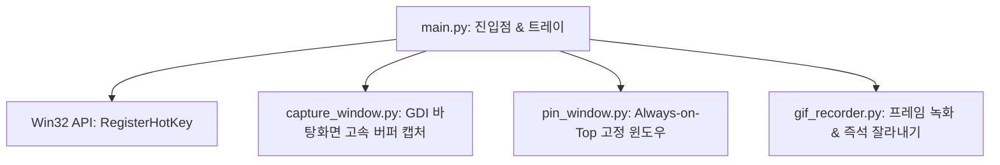

  
<strong>📌 프로젝트 요약</strong>

  <ul>
    <li><strong>💻 깃허브 저장소:</strong> <a href="https://github.com/JaeHyeon-Jo/lite-capture">JaeHyeon-Jo/lite-capture</a></li>
    <li><strong>🛠️ 사용 기술:</strong> Python 3, Qt, Win32 API (RegisterHotKey, GDI), PyInstaller</li>
    <li><strong>✨ 핵심 기능:</strong> 10MB 단일 0초 실행, 캡처 · 빨간 박스 · 화면 고정(핀) · GIF 녹화</li>
  </ul>

---

## 💡 1. 들어가며

> *"더 이상 기성 제품에 내 업무를 맞추어 쓰는 것이 아니라, 내가 원하는 기능만 조합해서 나만의 맞춤형 도구로 만들어 쓰는 시대가 되었다."*

하루에도 수십 번씩 쓰는 화면 캡처. 기능이 많은 상용 프로그램들은 무겁고, 단 한 번의 영역 캡처를 위해 필요 없는 편집 창이나 백그라운드 리소스를 낭비하곤 했습니다.

**내 손에 딱 맞는 단축키, 복잡한 설정 없는 10MB 안팎의 가벼움, 캡처 → 빨간 박스 주석 → 화면 고정이 끊김 없이 이어지는 쾌적함.**  
이 세 가지에 집중해 직접 개발한 초경량 캡처 유틸리티 **`lite-capture`**를 소개합니다.

---

## 📱 2. 주요 기능 & 시각적 경험 (UX)

### ① 화면 고정 (핀 창)

- 캡처한 영역을 모니터 최상단에 **불필요한 여백 없이 원본 이미지 그대로 고정(Pin)**합니다.
- 코딩 중 API 문서나 디자인 시안을 구석에 띄워두면 화면 전환 피로도가 크게 줄어듭니다.

### ② 즉시 빨간 박스 & 실시간 두께 조절
- 드래그 즉시 가장 자주 쓰는 **빨간 강조 박스**가 그려집니다.
- 메뉴 바를 찾을 필요 없이 **`Ctrl + 마우스 휠`**로 선 두께를 실시간 조절합니다.

### ③ GIF 녹화 & 앞뒤 구간 즉석 트리밍
- 버그 재현이나 UI 인터랙션을 녹화할 수 있는 **GIF 녹화**를 지원합니다.
- 녹화 직후 앞뒤 불필요한 멈춤 구간을 즉시 잘라내(Trimming) 바로 공유할 수 있습니다.

---

## 🛠️ 3. 기술 구조 (Qt + Win32 네이티브 API)

| 기술 모듈 | 적용 방식 | 핵심 효과 |
| :--- | :--- | :--- |
| **Win32 RegisterHotKey** | 키보드 후킹 대신 Windows API 직접 호출 | 전역 단축키 충돌 방지 & CPU 사용률 0% 대기 |
| **GDI 바탕화면 캡처** | 스냅샷 버퍼를 순간 렌더링 | 고해상도 모니터에서도 깜빡임/딜레이 없는 캡처 |
| **Win32 Mutex** | 단일 인스턴스 뮤텍스 메커니즘 | 트레이 중복 실행 차단 & 안정성 확보 |

---

## 💥 4. 트러블슈팅 요약

> [!tip] **SmartScreen 경고 및 중복 실행 방어**
> - **SmartScreen 이슈:** 개인 배포 `.exe` 특성상 첫 실행 시 경고 창이 발생하는 문제를 README 내 명확한 사용법 안내로 해결
> - **중복 실행 방어:** Win32 Mutex를 적용하여 기존 트레이 인스턴스를 보호하고 새 요청을 부드럽게 무시하도록 로직 구축

---

## 💭 5. 마치며

> *"지금 컴퓨터에서 비슷비슷한 도구들을 여러 개 켜두고 있다면, 핵심 기능만 하나로 합쳐보면 어떨까?"*

웹 서비스를 만드는 일도 훌륭하지만, 로컬 환경에서 내가 매일 피부로 느끼는 불편함을 코딩으로 직접 다듬고 개선해 나가는 과정은 개발자로서 잊을 수 없는 재미를 안겨줍니다. 나만의 워크플로우를 완성하는 도전을 추천합니다.

---

## 🔗 함께 읽으면 좋은 글
- [[Obsidian-GPS-위치-삽입-플러그인-개발기|Obsidian GPS Location — 내 입맛대로 만드는 메모 앱 플러그인]]
- [[D-Plus-Day-기록-트래커-개발기|D+Day — 이발 주기 헷갈려서 만든 D+ 트래커 개발 회고]]
- [[index|🍱 Guri Blog 홈으로 돌아가기]]
