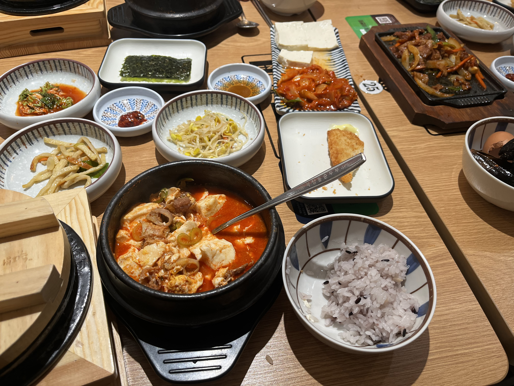

# 🍱 북창동순두부

> [!info] 📋 오늘의 점심
> **📍 위치:** 신대방동 
> **🍜 메뉴:** 곱창순두부 불고기 정식 
> **💬 한줄평:** 뭐 먹을지 고민될때 만만하게 올 수 있는 순두부 집

## 오늘 먹은 것

## 📍 위치
[네이버 지도에서 보기](https://map.naver.com/v5/?c=126.924042,37.491128,15,0,0,0,dh) | [구글 지도에서 보기](https://www.google.com/maps?q=37.491128,126.924042)

