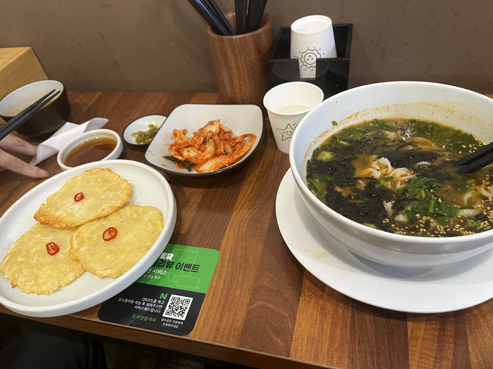

# 🍱 도리장칼국수

> [!info] 📋 오늘의 점심
> **📍 위치:** 신대방동 
> **🍜 메뉴:** 장칼국수 + 감자전 
> **💰 금액:** 19,000원 
> **💬 한줄평:** 바삭하고 얇은 감자전을 기대했지만, 끝은 바삭하지만 두꺼워서 감자맛이 강한 감자전

## 오늘 먹은 것

## 📍 위치
[네이버 지도에서 보기](https://map.naver.com/v5/?c=126.923522,37.491714,15,0,0,0,dh) | [구글 지도에서 보기](https://www.google.com/maps?q=37.491714,126.923522)

## 이 집 다른 방문 기록
[[식당/도리장칼국수|도리장칼국수 전체 방문 기록 보기]]

