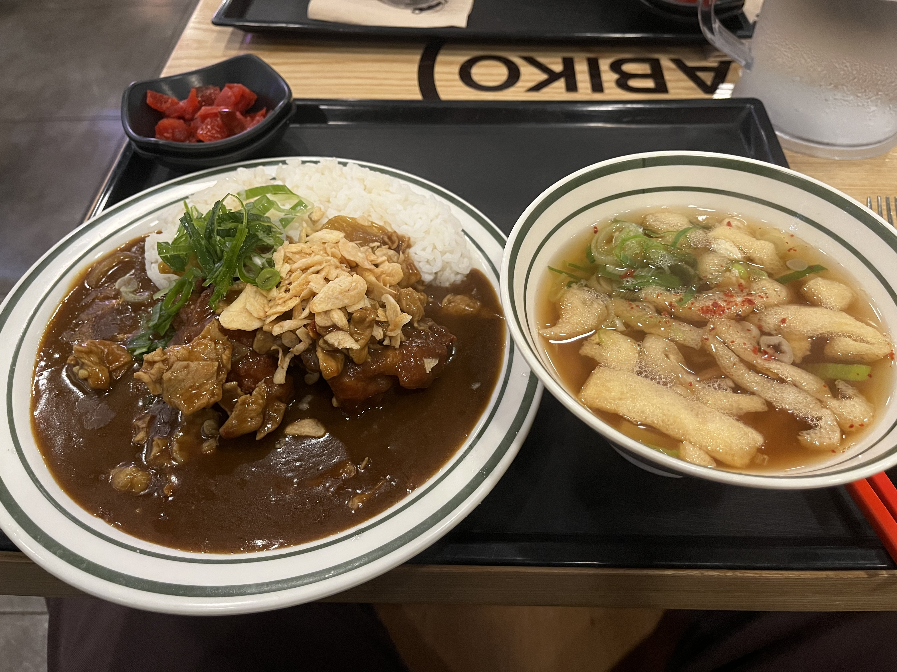

# 🍱 아비꼬

> [!info] 📋 오늘의 점심
> **📍 위치:** 신대방동 
> **🍜 메뉴:** 정식 A (돈육카레, 가라아게2점, 우동) 
> **💰 금액:** 16,500원 
> **💬 한줄평:** 자극적인 맛, 스트레스 받을때 가끔 올듯

## 오늘 먹은 것

## 📍 위치
[네이버 지도에서 보기](https://map.naver.com/v5/?c=126.924286,37.491478,15,0,0,0,dh) | [구글 지도에서 보기](https://www.google.com/maps?q=37.491478,126.924286)

