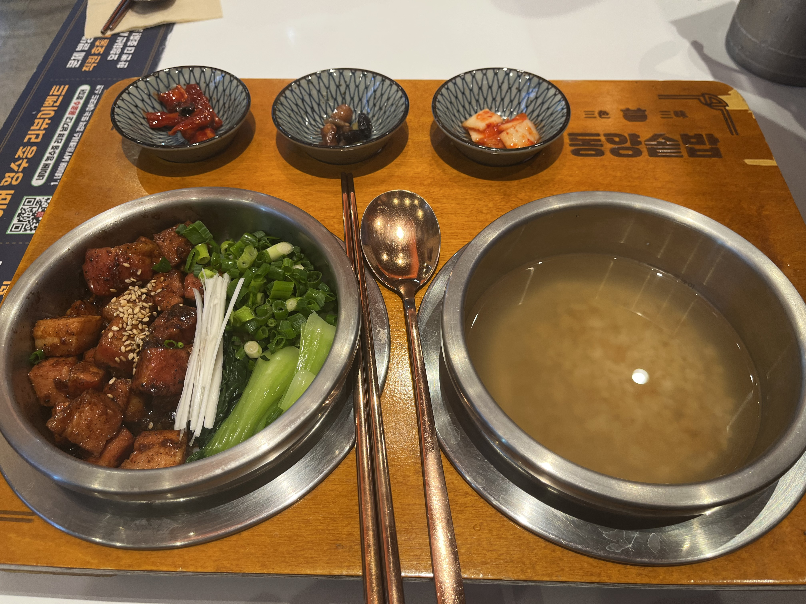

# 🍱 동양솥밥

> [!info] 📋 오늘의 점심
> **📍 위치:** 신대방동 
> **🍜 메뉴:** 동파육덮밥 
> **💰 금액:** 13,500원 
> **💬 한줄평:** 다른거 없이 숫가락으로 먹을수 있는 한끼 식사

## 오늘 먹은 것

## 📍 위치
[네이버 지도에서 보기](https://map.naver.com/v5/?c=126.924361,37.491264,15,0,0,0,dh) | [구글 지도에서 보기](https://www.google.com/maps?q=37.491264,126.924361)

## 이 집 다른 방문 기록
[[식당/동양솥밥|동양솥밥 전체 방문 기록 보기]]

