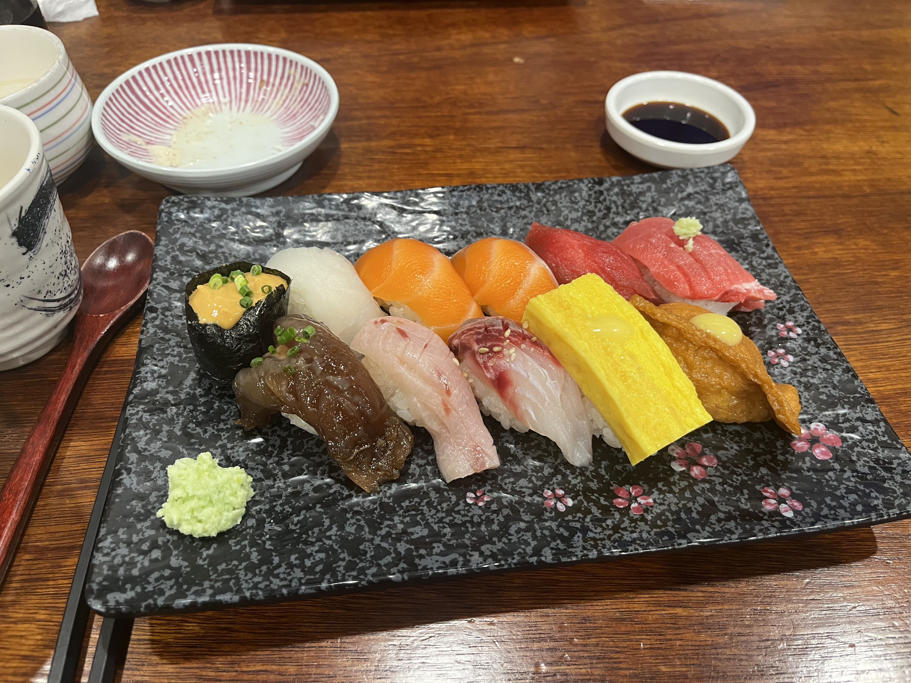

# 🍱 갓파도

> [!info] 📋 오늘의 점심
> **📍 위치:** 신대방동 
> **🍜 메뉴:** 특선초밥 
> **💰 금액:** 19,000원 
> **💬 한줄평:** 비싸지만 회랑 밥이 맛있는 초밥

## 오늘 먹은 것

## 📍 위치
[네이버 지도에서 보기](https://map.naver.com/v5/?c=126.923531,37.491672,15,0,0,0,dh) | [구글 지도에서 보기](https://www.google.com/maps?q=37.491672,126.923531)

## 이 집 다른 방문 기록
[[식당/갓파도|갓파도 전체 방문 기록 보기]]

