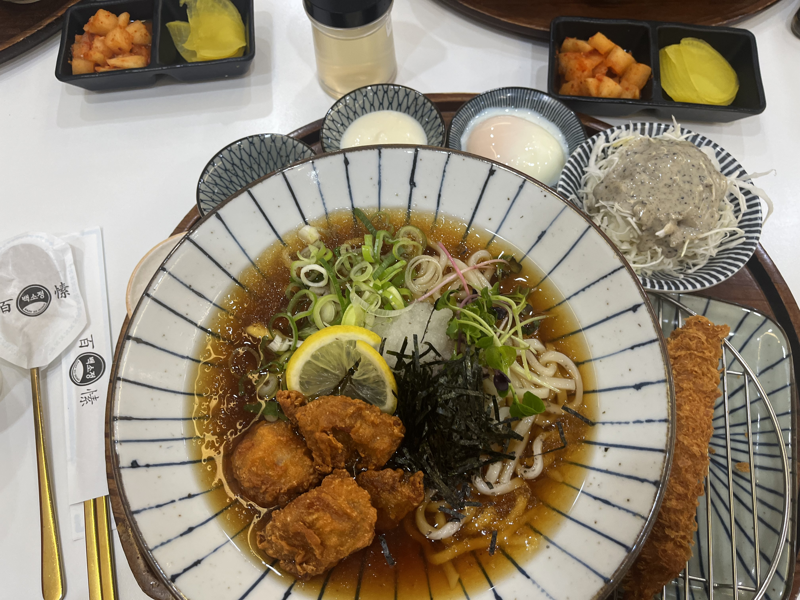

# 🍱 백소정

> [!info] 📋 오늘의 점심
> **📍 위치:** 신대방동 
> **🍜 메뉴:** 냉우동 가라아게 에비카츠 
> **💬 한줄평:** 면발이 엄청 쫄깃함~! 항상 중간은 가는 백소정

## 오늘 먹은 것

## 📍 위치
[네이버 지도에서 보기](https://map.naver.com/v5/?c=126.924422,37.491242,15,0,0,0,dh) | [구글 지도에서 보기](https://www.google.com/maps?q=37.491242,126.924422)

