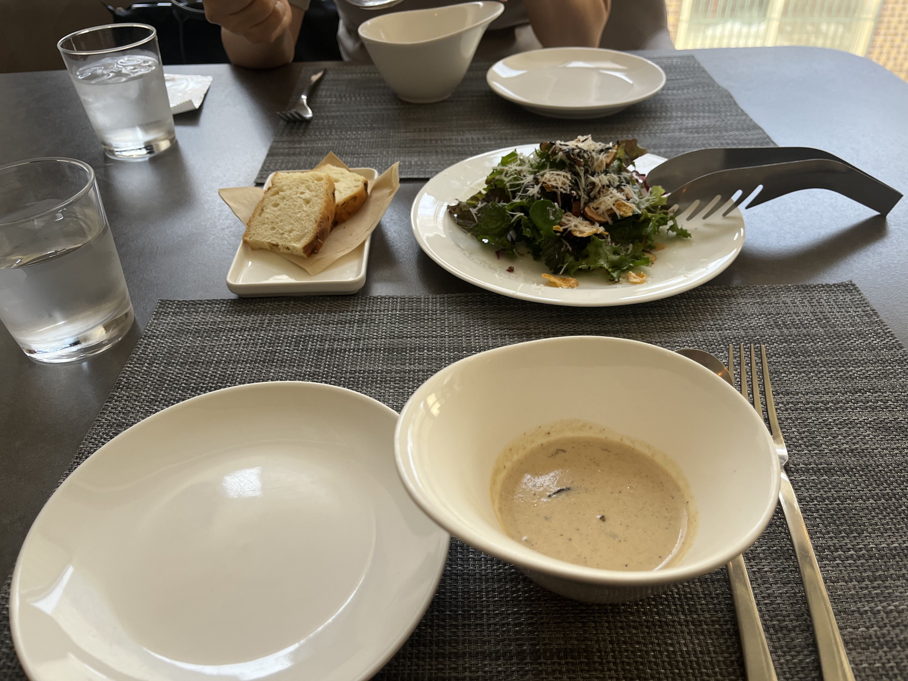

# 🍱 최다이닝

> [!info] 📋 오늘의 점심
> **📍 위치:** 상암동 
> **🍜 메뉴:** 피자, 파쉐, 스테이크 
> **💬 한줄평:** 다음에는 와인이랑 같이 꼭 먹고 싶은 곳

## 오늘 먹은 것

## 📍 위치
[네이버 지도에서 보기](https://map.naver.com/v5/?c=126.896706,37.577633,15,0,0,0,dh) | [구글 지도에서 보기](https://www.google.com/maps?q=37.577633,126.896706)

## 이 집 다른 방문 기록
[[식당/최다이닝|최다이닝 전체 방문 기록 보기]]

