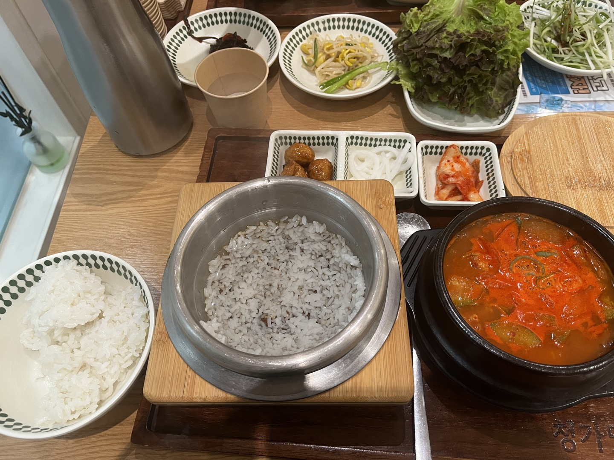

# 🍱 청가맛

> [!info] 📋 오늘의 점심
> **📍 위치:** 신대방동 
> **🍜 메뉴:** 돼지고추장찌개 
> **💬 한줄평:** 고기는 얼마 안 들었지만 맛은 있다

## 오늘 먹은 것

## 📍 위치
[네이버 지도에서 보기](https://map.naver.com/v5/?c=126.924522,37.492608,15,0,0,0,dh) | [구글 지도에서 보기](https://www.google.com/maps?q=37.492608,126.924522)

