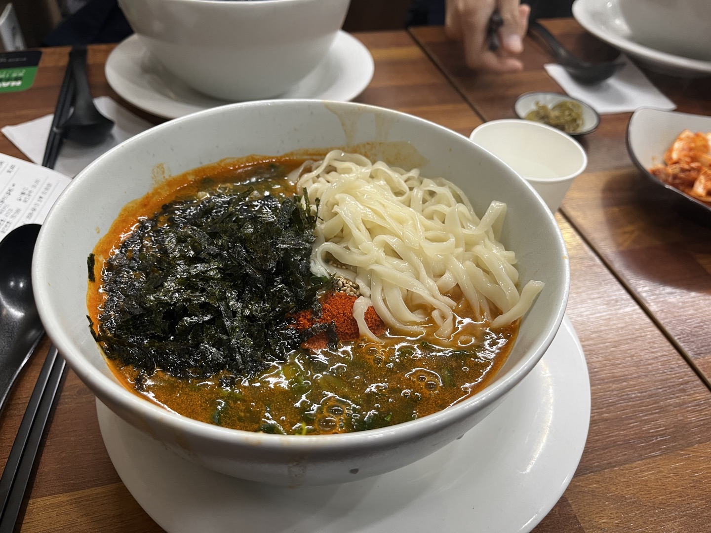

# 🍱 도리장칼국수

> [!info] 📋 오늘의 점심
> **📍 위치:** 신대방동 
> **🍜 메뉴:** 장칼국수 곱배기 
> **💰 금액:** 11,000원 
> **💬 한줄평:** 소박하지만 정성이 느껴지고 기분좋게 서비스 받는 느낌을 주는 곳

## 오늘 먹은 것

## 📍 위치
[네이버 지도에서 보기](https://map.naver.com/v5/?c=126.923508,37.491622,15,0,0,0,dh) | [구글 지도에서 보기](https://www.google.com/maps?q=37.491622,126.923508)

