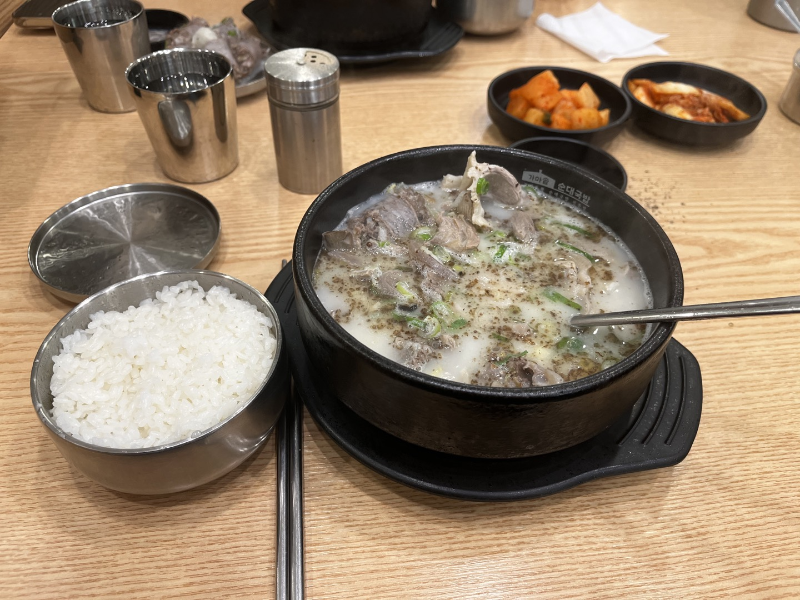

# 🍱 가마솥순대국밥 보라매공원점

> [!info] 📋 오늘의 점심
> **📍 위치:** 신대방동 
> **🍜 메뉴:** 사골순대국 특 
> **💰 금액:** 12,000원 
> **💬 한줄평:** 순대가 맛있는 순댓국집, 편백찜은 개인적으론 비추... 고기가 뻣뻣함

## 오늘 먹은 것

## 📍 위치
[네이버 지도에서 보기](https://map.naver.com/v5/?c=126.923789,37.491967,15,0,0,0,dh) | [구글 지도에서 보기](https://www.google.com/maps?q=37.491967,126.923789)

