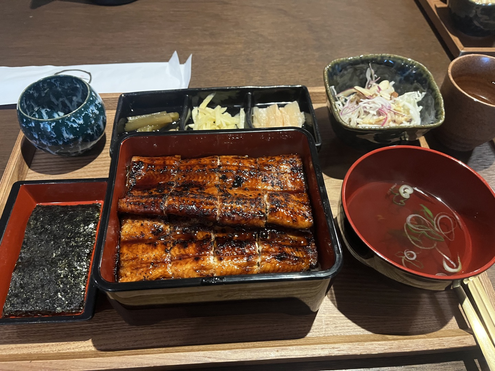

# 🍱 마담풍천

> [!info] 📋 오늘의 점심
> **📍 위치:** 봉천동 
> **🍜 메뉴:** 장어덮밥정식 
> **💰 금액:** 36,000원 
> **💬 한줄평:** 맛은 있지만 가격에 비하면 부족한 느낌, 뭔가 좀더 후식 같은게 있으면 좋을것 같다. 장어는 부드럽고 맛있음 양도 넉넉하고

## 오늘 먹은 것

## 📍 위치
[네이버 지도에서 보기](https://map.naver.com/v5/?c=126.926392,37.490647,15,0,0,0,dh) | [구글 지도에서 보기](https://www.google.com/maps?q=37.490647,126.926392)

