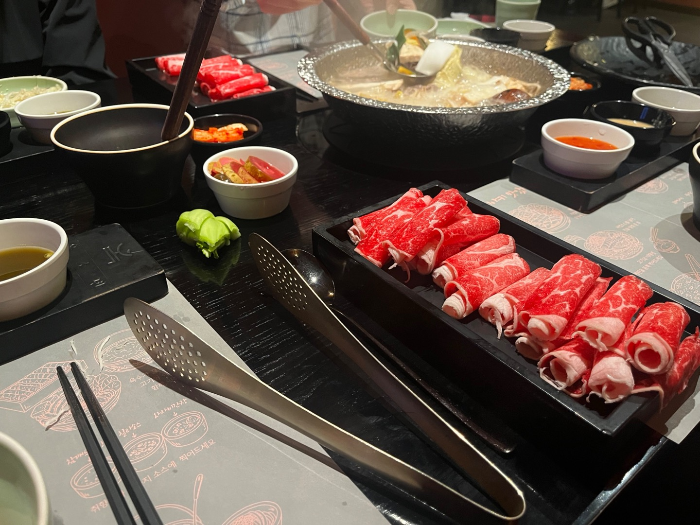

# 🍱 옥소반 보라매공원점

> [!info] 📋 오늘의 점심
> **📍 위치:** 신대방동 
> **🍜 메뉴:** 샤브샤브 살치살 
> **💰 금액:** 18,000원 
> **💬 한줄평:** 금액은 헷갈림 고기에 따라 다름, 야채 무한 리필 되고 고기도 신선하고 맛있다!

## 오늘 먹은 것

## 📍 위치
[네이버 지도에서 보기](https://map.naver.com/v5/?c=126.923775,37.491589,15,0,0,0,dh) | [구글 지도에서 보기](https://www.google.com/maps?q=37.491589,126.923775)

